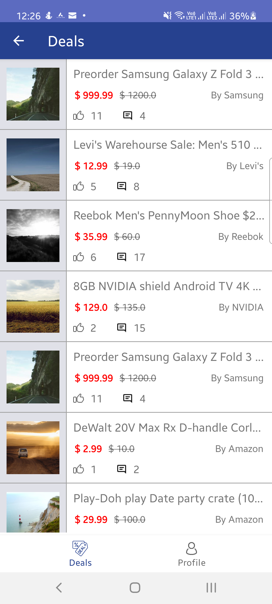
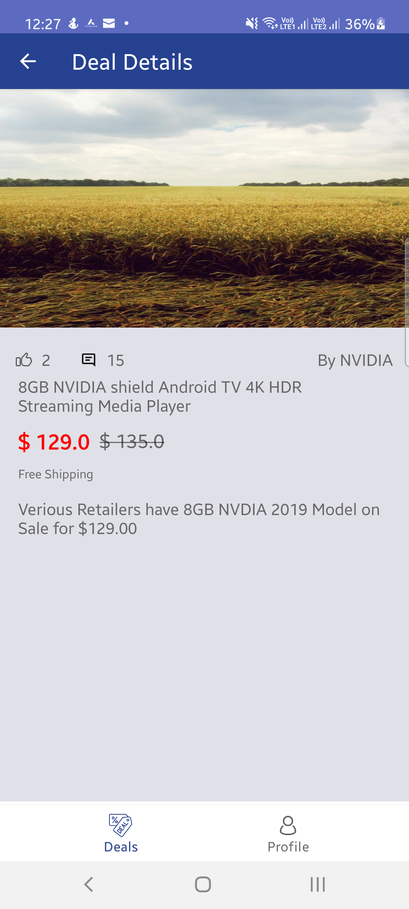

# Android MVVM Architecture: Sample App

## Screenshots
<p align="center">


</p>

## Programming Practices Followed

1) Android Architectural Components
2) Dagger 2 for Dependency Injection
3) MVVM & LiveData
4) Retrofit with Okhttp
5) Repository Pattern
6) Coroutine, Coroutine Flow
7) DataBinding
8) JUnit and Mockito for Unit Testing - `Pending ( In Future )`

## Branches

There are different branches as per the practices followed, namely:

* [`master`](https://github.com/prbale/MVVMDemoApp/tree/master) - Master Branch, Empty.
* [`mvvm_viewmodel_livedata_retrofit`](https://github.com/prbale/MVVMDemoApp/tree/mvvm_viewmodel_livedata_retrofit) - MVVM Implementation with LiveData
* [`mvvm_with_dagger_implementation`](https://github.com/prbale/MVVMDemoApp/tree/mvvm_with_dagger_implementation) - Dagger DI based implementation
* [`coroutine_implementation`](https://github.com/prbale/MVVMDemoApp) - Kotlin Coroutine implementation
* [`coroutine_flow_implementation`](https://github.com/prbale/MVVMDemoApp/tree/coroutine_flow_implementation) - Kotlin Coroutine Flow Implementation
  
   
## Package Structures

```
com.bale.demoapplication # Root Package
├── constants            # Api and Application related constants
├── data                 # For data modeling layer
│   ├── model            # Data classes
│   └── repository       # Repository and dependent classes
|
├── dependencyinjection  # Dependency injection modules
│   ├── builder          # Activity and Fragment Builder Modules
│   ├── component        # Application Component
│   └── module           # Other Modules used for DI
|       └── viewmodel    # ViewModel Module and dependent classes
│
├── extension            # Kotlin extensions
|
├── listeners            # Listeners
|
├── ui                   # Fragment / View layer
│   ├── base             # Base Classes for Activity and Fragment
│   ├── dealDetails      # Detail screen Fragment and ViewModel
│   ├── dealList         # List screen Fragment and ViewModel
│   ├── profile          # Profile screen Fragment and ViewModel
│   └── MainActivity     # Parent Activity
|
└── DealsApplication     # Application Class

```

### Contributing and reporting issues

You can to contribute in this repository. Just make pull request.

I appreciate any question or comment.
